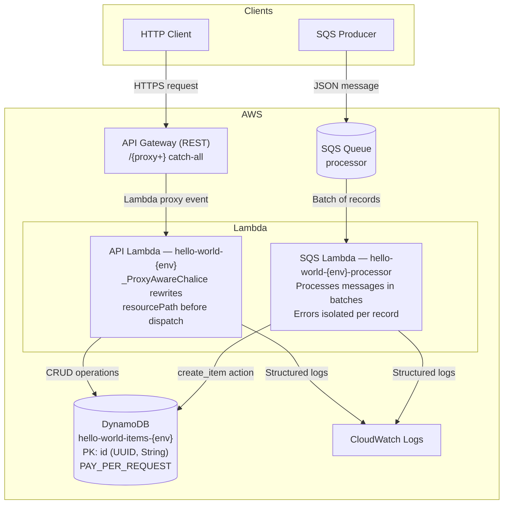
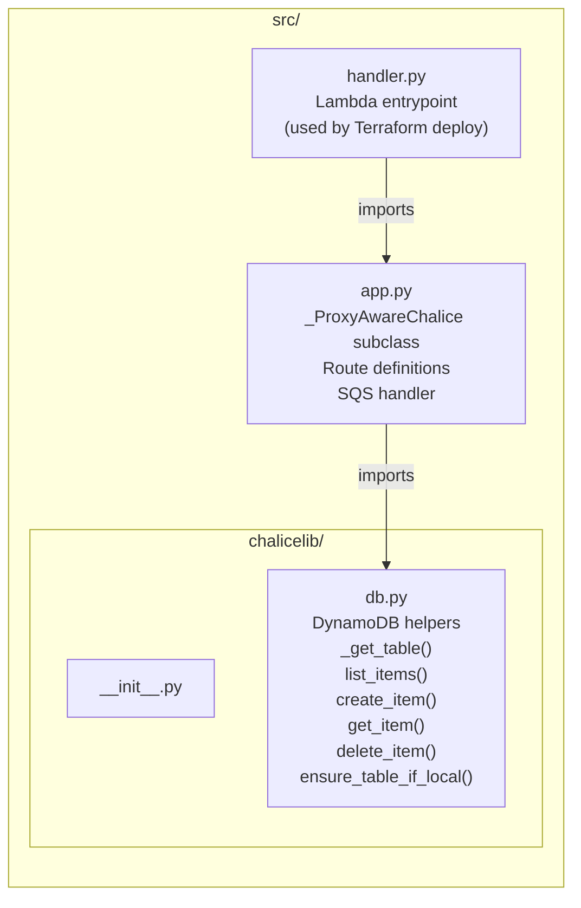
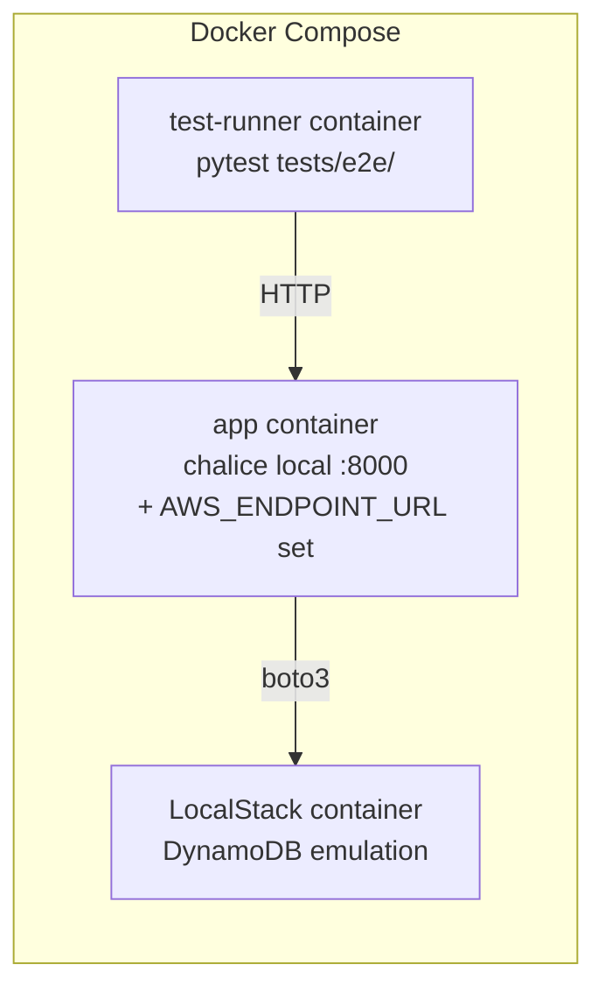

# Application Design

## Overview

Hello World is a serverless REST API built with [AWS Chalice](https://aws.github.io/chalice/) (Python 3.12). It exposes a CRUD interface for *items* stored in DynamoDB, and processes background work through an SQS queue.

---

## Request Flow



---

## API Routes

| Method | Path | Handler | Response |
|--------|------|---------|----------|
| `GET` | `/health` | `health()` | `200` — `{status, uptime_seconds}` |
| `GET` | `/` | `index()` | `200` — `{message, env, version}` |
| `GET` | `/items` | `list_items()` | `200` — array of items |
| `POST` | `/items` | `create_item()` | `201` — created item; `400` if `name` missing |
| `GET` | `/items/{item_id}` | `get_item()` | `200` — item; `404` if not found |
| `DELETE` | `/items/{item_id}` | `delete_item()` | `204`; `404` if not found |

**SQS handler** — `handle_processor_queue(event)`: processes messages from the `processor` queue. Expected message body:
```json
{ "action": "create_item", "name": "...", "description": "..." }
```
Errors are caught per record so one bad message does not block the rest of the batch.

---

## Code Structure



### Key design notes

- **`_ProxyAwareChalice`** — Terraform's API Gateway uses a single `/{proxy+}` catch-all resource. Chalice's default dispatcher matches on `resourcePath`, which always arrives as `/{proxy+}`. This subclass rewrites `requestContext.resourcePath` to the actual request path before dispatching, fixing `405` errors.

- **`db.ensure_table_if_local()`** — called at module import time. Auto-creates the DynamoDB table **only** when `AWS_ENDPOINT_URL` is set (i.e. LocalStack). No-op in real AWS.

- **`AWS_ENDPOINT_URL`** — must be set when running locally/in Docker; must be **unset** in Lambda (real AWS).

---

## Local Development



```bash
# Run e2e tests against LocalStack
docker compose -f docker-compose.test.yml up --abort-on-container-exit

# Run unit tests (moto — no Docker needed)
pytest tests/unit/
```

**Unit test strategy**: `moto` mocks all AWS SDK calls in-process. `chalice.test.Client` invokes handlers directly without an HTTP server. Environment variables (`TABLE_NAME`, `AWS_DEFAULT_REGION`, fake credentials) **must be set before importing the app** — see [`tests/unit/conftest.py`](../tests/unit/conftest.py).
