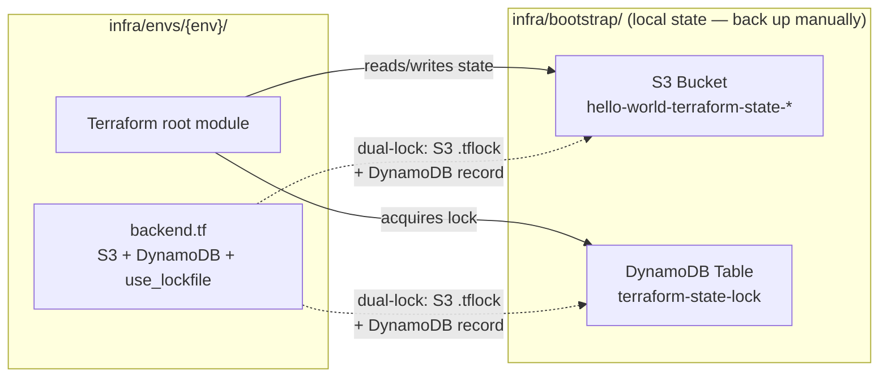
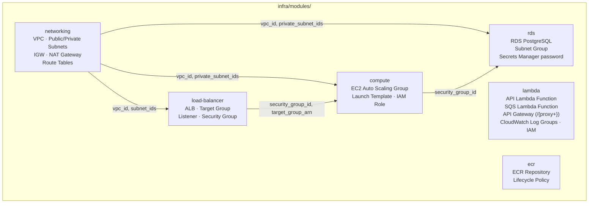
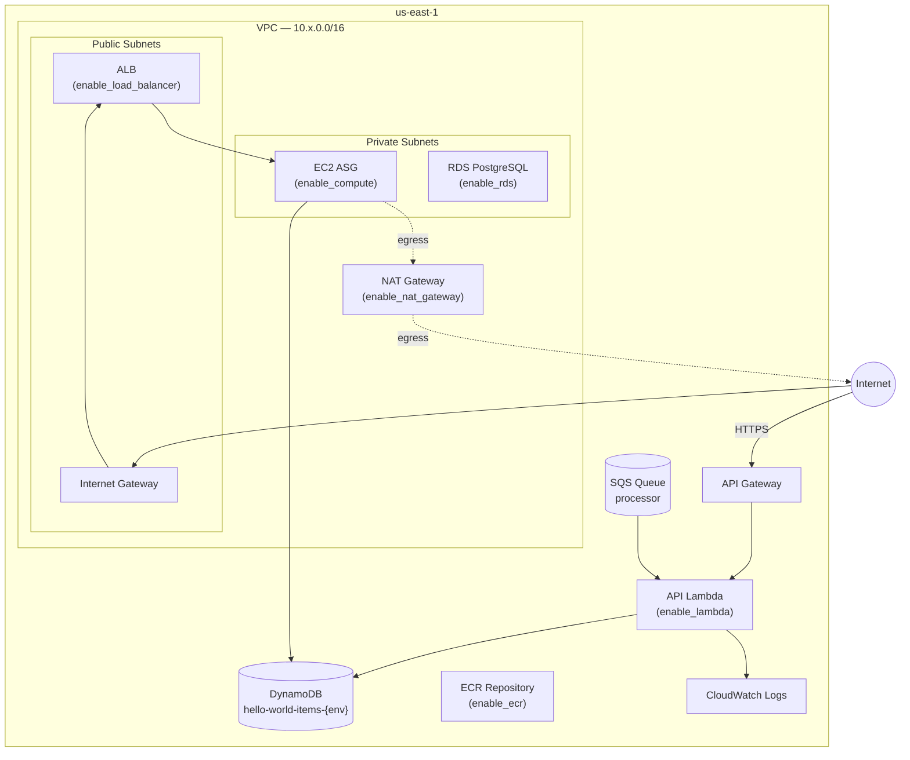
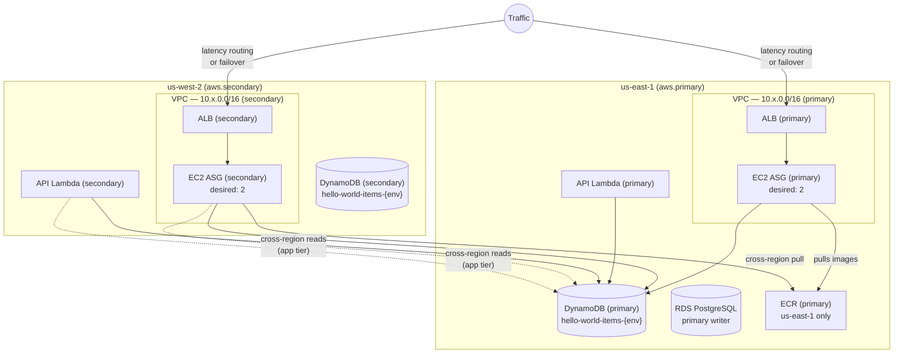

# Infrastructure Design

## Overview

Infrastructure is managed entirely by **Terraform ≥ 1.10** and organized into reusable modules consumed by per-environment root modules. State is stored remotely in S3 with dual-lock protection.

Full environment details: [README.md §3](../README.md#3-environment-overview)

---

## Environment Matrix

| Environment | Purpose | Regions | NAT | Multi-region |
|-------------|---------|---------|-----|--------------|
| `dev` | Developer sandbox | us-east-1 | ✗ | ✗ |
| `test` | Internal QA | us-east-1 | ✗ | ✗ |
| `perf` | Load / performance testing | us-east-1 + us-west-2 | ✓ | ✓ |
| `staging` | Integration / UAT | us-east-1 + us-west-2 | ✓ | ✓ |
| `production` | Live workloads | us-east-1 + us-west-2 | ✓ | ✓ |

---

## State Management



> **Dual-lock**: backends set both `dynamodb_table` and `use_lockfile = true`, requiring Terraform ≥ 1.10 and AWS provider ≥ 5.86. This writes locks to DynamoDB **and** an S3 `.tflock` file simultaneously.

---

## Module Architecture



Every module follows these conventions:

- **Single responsibility** — one module per infrastructure concern
- **Output-first** — all resource IDs/ARNs exposed as outputs
- **Provider-agnostic** — callers pass provider aliases; modules never configure credentials
- **Testable** — ships with `tests/<name>_test.tftest.hcl` using `mock_provider "aws" {}`

---

## Single-Region Architecture (dev / test)



Feature flags in `terraform.tfvars` control which modules are active:

```hcl
enable_networking    = true
enable_load_balancer = false
enable_compute       = false
enable_lambda        = true   # Lambda + API Gateway
enable_rds           = false
enable_ecr           = false
```

---

## Multi-Region Architecture (perf / staging / production)

Provider aliases deploy identical infrastructure into two regions **simultaneously (active-active)**:



> **RDS** — single writer in `us-east-1` only. Aurora Global Database or read replicas can be added as a separate concern.  
> **ECR** — single registry in `us-east-1`; cross-region replication can be enabled when pull latency is a concern.

---

## Security Controls

| Layer | Control |
|-------|---------|
| **IAM** | OIDC federation — no long-lived AWS keys in CI/CD |
| **Secrets** | RDS credentials in Secrets Manager; no plaintext in Terraform state |
| **SQS** | SSE enabled (`sqs_managed_sse_enabled = true`) |
| **OPA / Conftest** | Policy-as-code checks on every `terraform plan` output: no hardcoded secrets, no `:latest` image tags, approved service-linked roles only, VPC DNS settings enforced |
| **Protected envs** | `staging` / `production` require typed name confirmation in CLI and a GitHub Environment reviewer approval in CI/CD |
| **State locking** | Dual-lock (DynamoDB + S3 `.tflock`) prevents concurrent applies |

---

## VPC CIDR Allocation

Pre-allocated, non-overlapping blocks reserved for future VPC peering:

| Environment | Region | VPC CIDR |
|-------------|--------|----------|
| dev | us-east-1 | 10.0.0.0/16 |
| test | us-east-1 | 10.1.0.0/16 |
| perf | us-east-1 | 10.2.0.0/16 |
| perf | us-west-2 | 10.3.0.0/16 |
| staging | us-east-1 | 10.4.0.0/16 |
| staging | us-west-2 | 10.5.0.0/16 |
| production | us-east-1 | 10.6.0.0/16 |
| production | us-west-2 | 10.7.0.0/16 |
