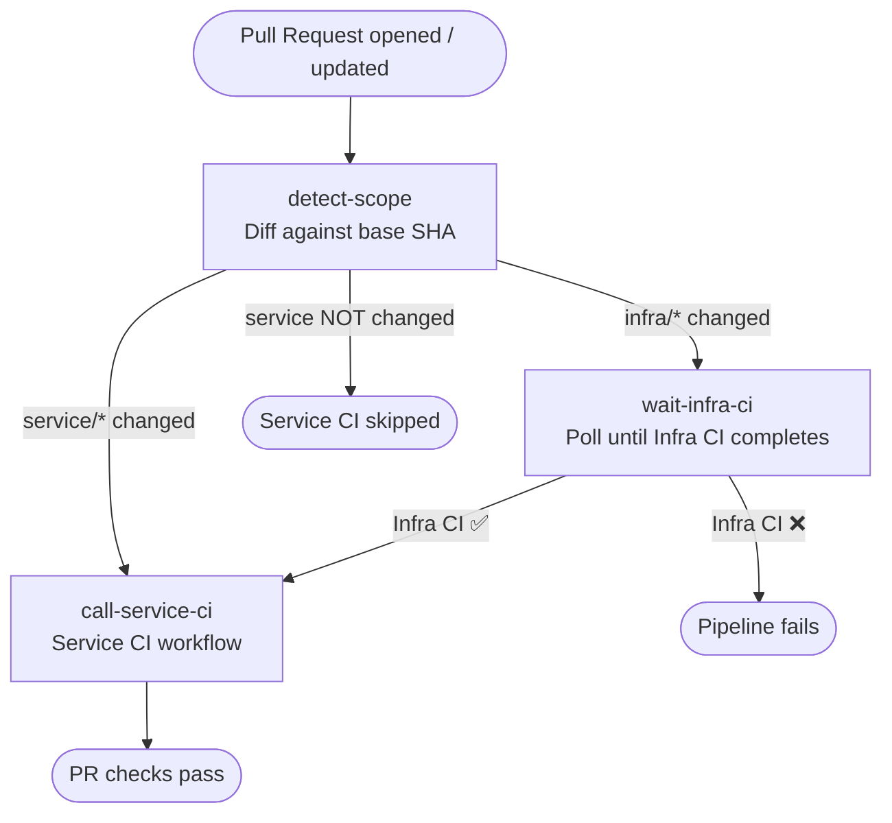
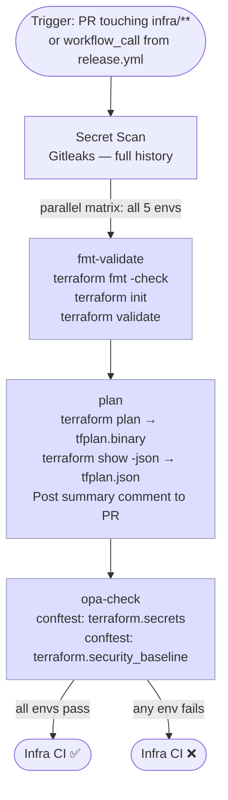
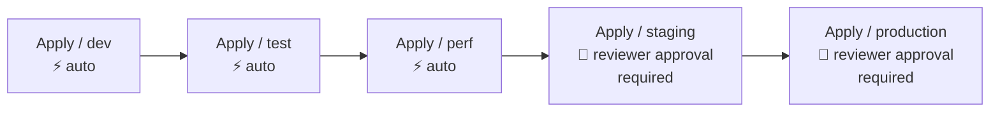
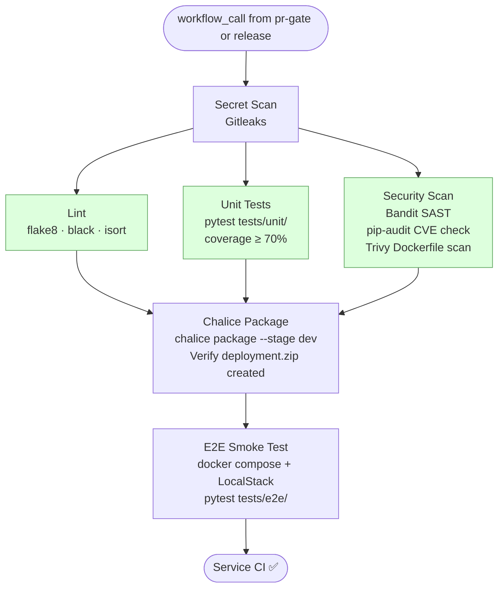
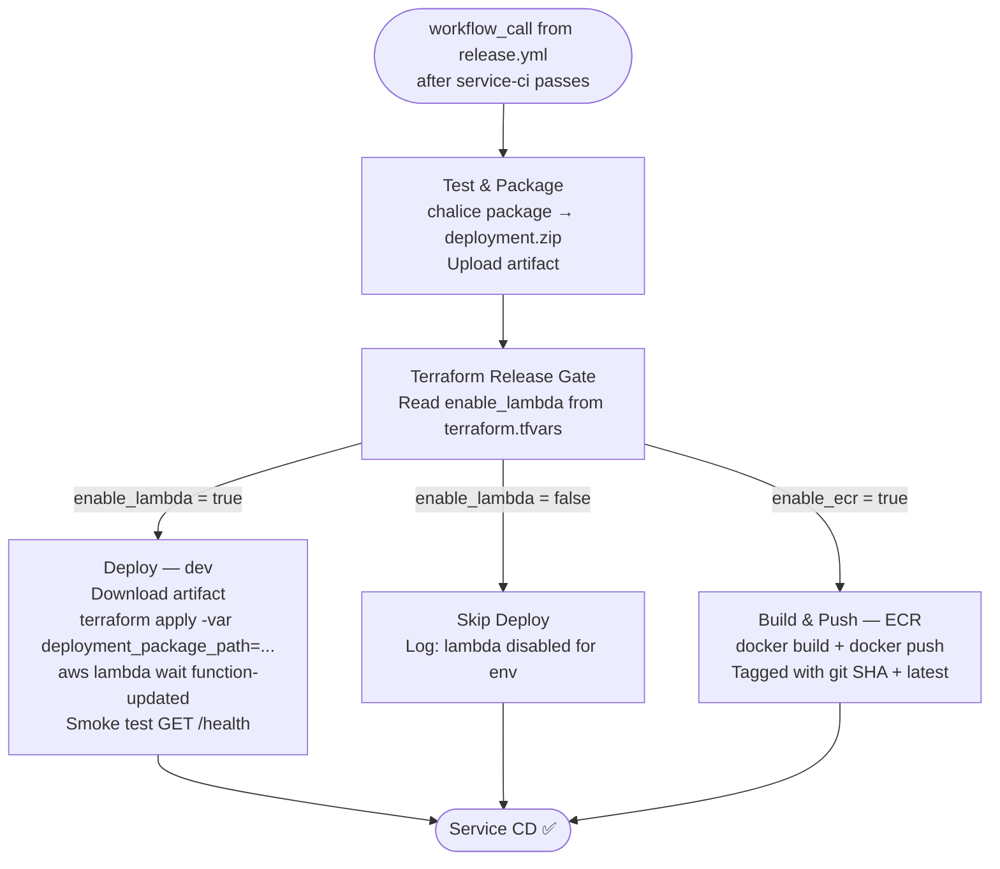
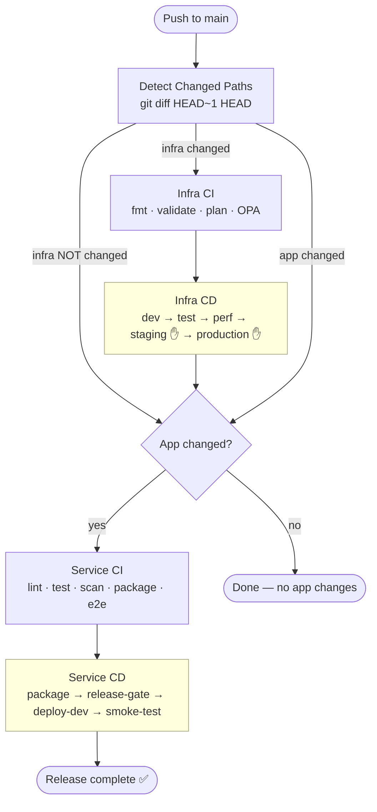

# Pipeline Design

## Overview

All CI/CD runs on **GitHub Actions**. There are two independent pipeline tracks — **Infra** (Terraform) and **Service** (Python/Chalice) — orchestrated by a common PR Gate and Release workflow.

Workflow files: [`.github/workflows/`](../.github/workflows/)

---

## Workflow Inventory

| File | Trigger | Purpose |
|------|---------|---------|
| `pr-gate.yml` | PR → `main` | Detects scope, orders Infra CI before Service CI |
| `infra-ci.yml` | PR (infra paths) / `workflow_call` | fmt · validate · plan · OPA policy check |
| `infra-cd.yml` | `workflow_call` / `workflow_dispatch` | Sequential env promotion: dev → staging → production |
| `service-ci.yml` | `workflow_call` | secret-scan · lint · unit test · security scan · package · e2e |
| `service-cd.yml` | `workflow_call` | Build artifact → Terraform release gate → deploy Lambda → smoke test |
| `release.yml` | Push → `main` | Detects changes, chains: infra-ci → infra-cd → service-ci → service-cd |

---

## PR Gate (Pull Request → `main`)

**Key rule**: if the same PR touches both infra and app code, Service CI is held until Infra CI passes. This prevents deploying application code against an infrastructure that may not yet be valid.

---

## Infra CI (on PR or called by Release)

- Each matrix stage runs **all 5 environments in parallel** (`fail-fast: false`)
- Stale runs on force-push are cancelled (`concurrency: cancel-in-progress: true`)
- Plan artifacts (`tfplan.binary`, `tfplan.json`) are uploaded and consumed by the OPA stage

---

## Infra CD (Sequential Environment Promotion)

Triggered by `release.yml` after Infra CI passes. Each job requires the previous to succeed — a failure stops the chain.

Each apply job:
1. Runs OPA `approval` policy check (pre-apply metadata)
2. `terraform init`
3. `terraform apply -var-file=terraform.tfvars -auto-approve`

> **Concurrency**: `cancel-in-progress: false` — a second push queues behind an in-flight apply instead of cancelling it (safer for infrastructure).

---

## Service CI

---

## Service CD

> **Lambda deployment via Terraform** — the pipeline never calls `aws lambda update-function-code` directly. It passes the zip path as a Terraform variable; the `null_resource` in the lambda module calls the AWS CLI, keeping all resource management inside Terraform.

---

## Full Release Chain (Push → `main`)

**Concurrency**: the `release` concurrency group uses `cancel-in-progress: false` — only one release runs at a time, but a second push waits in queue rather than cancelling an in-flight deployment.

---

## Security Controls in Pipeline

| Control | Where |
|---------|-------|
| Gitleaks secret scan | First job in every CI workflow (blocks on secrets found) |
| Bandit SAST | Service CI — `security-scan` job |
| pip-audit CVE scan | Service CI — `security-scan` job |
| Trivy Dockerfile scan | Service CI — `security-scan` job |
| OPA / Conftest | Infra CI + Infra CD — policy checks on plan JSON and deployment metadata |
| OIDC (no static AWS keys) | All jobs that touch AWS use `configure-aws-credentials` with `role-to-assume` |
| GitHub Environment protection | `staging` and `production` require ≥ 1 reviewer before apply |
| Branch protection | All changes to `main` go through PR — enforced via GitHub branch rules |
